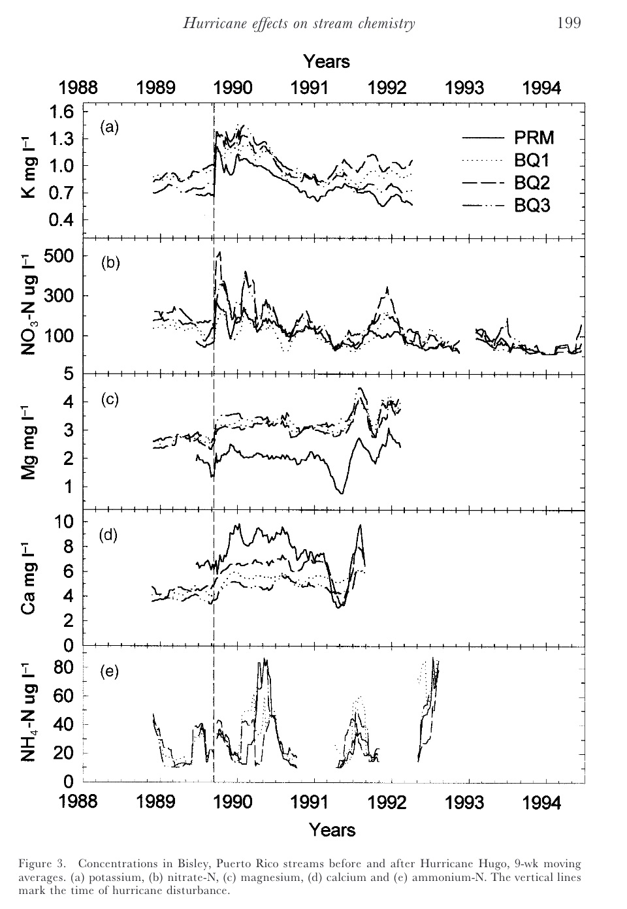

# Recreating Figure 3 of Schaefer et al. (2000)
## Purpose
This repository contains the instructions and code to reproduce Figure 3 from the paper "Effects of hurricane disturbance on stream water concentrations and fluxes in eight tropical forest watersheds of the Luquillo Experimental Forest, Puerto Rico" by Schaefer et al. (2000) Figure 3 shows nutrient concentrations in Bisley, Puerto Rico streams before and after Hurricane Hugo using 9-week moving averages.

Original figure 3 from Schaefer et al. (2000)

## Repository Structure
This repository is structured as follows: 

- **1_clean_data.R** script imports the raw data and processes it into a useable dataframe for plotting.
- **assessments/** contains self- and peer-assessments on the progress of this project.
- **data/** houses the raw data from this study. 
- **docs/** hosts the rendered **paper.html**. 
- **images/** includes image files for use in this README.
- **output/** contains a .csv of cleaned data, produced by the **1_clean_data.R** script.
- **paper/** includes the **paper.qmd file**, which renders the **final paper.html**.
- **R/** defines the moving average function for use in data cleaning (in the **moving-average.R** script).
- **scratch/** contains draft code for the analysis. 

## Data Access
The raw “Chemistry of Stream Water from the Luquillo Mountains" datasets are housed in the **data/knb-lter-luq.20.4923064** folder. The files needed to recreate this figure are as follows:  

- QuebradaCuenca1-Bisley.csv  
- QuebradaCuenca2-Bisley.csv  
- QuebradaCuenca3-Bisley.csv  
- RioMameyesPuenteRoto.csv

The raw data was cleaned and formatted for plotting using the **1_clean_data.R** script, which produced **clean_data.csv** in the output folder. The **paper.qmd** file contains code that loads the clean data independently (e.g. without needing to have all of the raw data downloaded locally). 

The original data is maintained online through the Environmental Data Initiative. You can find them here: [McDowell and International Institute Of Tropical Forestry (IITF) 2024](https://portal.edirepository.org/nis/mapbrowse?packageid=knb-lter-luq.20.4923064).

## Authors
[Courtney Lorey](https://github.com/cllorey/cll214final), Bren School of Environmental Science & Management, University of California, Santa Barbara

### Contributors
[Liam Sarmiento](https://github.com/Apathy-Wildflowers), Bren School of Environmental Science & Management, University of California, Santa Barbara

[Rachel Miller](https://github.com/RachelMGitH), Bren School of Environmental Science & Management, University of California, Santa Barbara

## References 
McDowell, William H., and USDA Forest Service. International Institute Of Tropical Forestry (IITF). 2024. “Chemistry of Stream Water from the Luquillo Mountains.” Environmental Data Initiative. [https://doi.org/10.6073/PASTA/F31349BEBDC304F758718F4798D25458](https://doi.org/10.6073/PASTA/F31349BEBDC304F758718F4798D25458).  
Schaefer, Douglas. A., William H. McDowell, Fredrick N. Scatena, and Clyde E. Asbury. 2000. “Effects of Hurricane Disturbance on Stream Water Concentrations and Fluxes in Eight Tropical Forest Watersheds of the Luquillo Experimental Forest, Puerto Rico.” Journal of Tropical Ecology 16 (2): 189–207. [https://doi.org/10.1017/s0266467400001358](https://doi.org/10.1017/s0266467400001358).